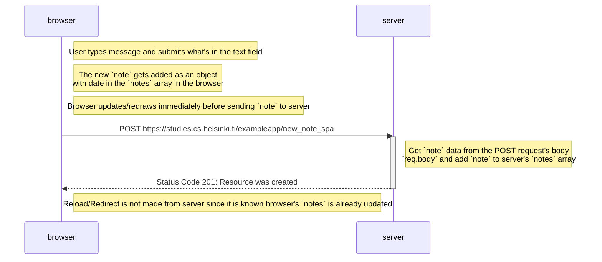

```mermaid
sequenceDiagram
    participant browser
    participant server

    Note right of browser: User types message and submits what's in the text field
    Note right of browser: The new `note` gets added as an object <br/> with date in the `notes` array in the browser
    Note right of browser: Browser updates/redraws immediately before sending `note` to server

    browser->>server: POST https://studies.cs.helsinki.fi/exampleapp/new_note_spa
    activate server
    Note right of server: Get `note` data from the POST request's body <br/> `req.body` and add `note` to server's `notes` array
    server-->>browser: Status Code 201: Resource was created
    deactivate server

    Note right of browser: Reload/Redirect is not made from server since it is known browser's `notes` is already updated
```
